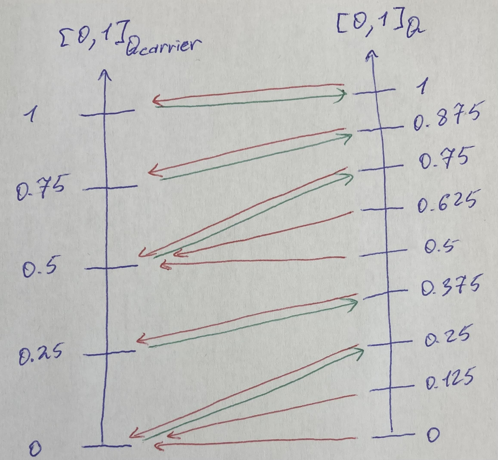

# A Structured approach to Quotation pricing in Container Shipping

Container‑shipping rate setting often looks reactive and chaotic: market swings, inconsistent customer behavior, and noisy acceptance/rejection outcomes. This note does not attempt to solve pricing end‑to‑end, but instead isolates and studies a simple mathematical core of the problem: how quote requests and candidate rates interact through accept/reject decisions.  
  
We treat this core as a small case study in applied category theory and order theory. The central object is a feasibility relation that records, for each request–rate pair, whether the quote would be accepted or rejected, and we use it to introduce basic notions such as enriched profunctors, nuclei, and Galois adjunctions in a concrete setting. Familiar constructs—willingness‑to‑pay curves, rejection and booking curves, and suggested selling rates—then appear as derived objects of this single relation once we impose a bit of structure.

---

## 1. Market Requests as a Total Order

We begin with the set of all market quote requests:

$$
Q_{\text{market}} = \{q_{(1)}, q_{(2)}, \dots, q_{(N)}\}.
$$

We assume that **these requests can be totally ordered**:

$$
q_{(1)} \le q_{(2)} \le \dots \le q_{(N)}.
$$

### What does this order represent?

Many things in pricing behave monotonically:

- shipment volume  
- service urgency/flexibility  
- customer segment  
- historical behavior  
- any internal “flexibility” or “value” score

As long as *higher* in the order means *more willing to pay*, the model works.

---

## 2. Market Rates Respect the Same Ordering

We similarly assume the market has an ordered set of rates:

$$
R_{\text{market}}.
$$

There is a one-to-one **monotone map**:

$$
m : Q_{\text{market}} \to R_{\text{market}}
$$

assigning each request the “market-clearing” rate.

### Meaning of monotonicity

If one request is less sensitive and sits higher in the order, the rate assigned to it must not be lower than that of a more sensitive request.

---

## 3. Acceptance/Rejection as a Boolean Feasibility Relation
Because requests and rates share the same ordering, any quote request can be paired with any candidate market rate and classified: either the offered rate sits below that request’s clearing level and is accepted, or it exceeds it and is rejected.
Acceptance occurs when the offered rate does not exceed the clearing rate of the request. 
$$
r \le m(q).
$$

Formally, treat this as a feasibility relation: it is antitone in the rate (higher rates are harder to accept) and monotone in the request (less-sensitive customers accept more). Using the opposite order on rates makes the relation monotone in both arguments:

$$
F : R_{\text{market}}^{op} \times Q_{\text{market}}
\to \mathbf{Bool},
\qquad
F(r,q) = (r\le m(q)).
$$

This is the fundamental decision rule; rejection happens exactly when $F(r,q)$ is false. 

---

## 4. Quantile Embeddings: Putting Everything on $[0,1]$

To compare requests and rates cleanly, embed any finite total order $Q$ into $[0,1]$ by turning each element into its cumulative rank: count how many elements are at or below it, then divide by $|Q|$.

Define the quantile embedding
$$
\phi_Q : Q \to [0,1],
\qquad
\phi_Q(q)
= \frac{|\{q' \in Q : q' \le q\}|-1}{|Q|-1}.
$$

![Quantile embedding of a finite totally ordered set $Q$ into $[0,1]$](figures/quantile_embedding.jpg)

A more explicit form of that embedding:
- Begin with the canonical feasibility relation $\mathrm{hom}_Q : Q^{op}\times Q \to \mathbf{Bool}$, which just records the order: $\mathrm{hom}_Q(q',q) = \mathbf{true}$ exactly when $q'\le q$.

- Curry it in the first argument: fix $q$ and read $\mathrm{hom}_Q(\,\cdot\,,q)$ as an ordinary function $Q \to \mathbf{Bool}$—this is the indicator (1 if an element is in a set, 0 otherwise) of the principal down-set $\downarrow q$ (all elements $\le q$), written $\chi_{\downarrow q} : Q \to \mathbf{Bool}$ with $\chi_{\downarrow q}(q') = \mathrm{hom}_Q(q',q)$.

-- Average those indicators uniformly over all $q' \in Q$: sum the Boolean values (1 when $q' \le q$, 0 otherwise) and divide by $|Q|$. This produces a cumulative rank; we then rescale it so that the minimum of $Q$ maps to $0$ and the maximum to $1$, with equal steps in between. This is the same averaging/rescaling used later when integrating feasibility relations in section 9.2. In terms of the embedding $\phi_Q$ defined above, this is
$$
\phi_Q(q)
= \frac{1}{|Q|-1}
\sum_{q' \in Q} \chi_{\downarrow q}(q')
- \frac{1}{|Q|-1}
= \frac{1}{|Q|-1}
\sum_{q' \in Q} \mathrm{hom}_Q(q',q)
- \frac{1}{|Q|-1}.
$$
Here the sum counts how many elements lie in $\downarrow q$: each indicator contributes 1 when $q'$ is below $q$ and 0 otherwise. Subtracting $1$ and dividing by $|Q|-1$ linearly rescales this cumulative rank so that the minimum element of $Q$ gets value $0$ and the maximum gets value $1$.

### Request quantiles
Applied to market requests (take $Q = Q_{\text{market}}$):

$$
\phi_Q : Q_{\text{market}} \to [0,1],
\qquad
\phi_Q(q) = \frac{|\{q' \in Q_{\text{market}} : q' \le q\}|-1}{|Q_{\text{market}}|-1}
= \frac{k-1}{N-1} \text{ for } q = q_{(k)}.
$$

Every request gets a rank between 0 and 1. We write
$$
[0,1]_Q := \mathrm{im}(\phi_Q) \subseteq [0,1]
$$
for the resulting request‑quantile axis inside the unit interval.

### Rate quantiles

$$
\phi_R : R_{\text{market}} \to [0,1].
$$

For rates, the same construction with $P = R_{\text{market}}$ gives:

$$
\phi_R(r) = \frac{|\{r' \in R_{\text{market}} : r' \le r\}|-1}{|R_{\text{market}}|-1}.
$$
We similarly denote the image of $\phi_R$ by
$$
[0,1]_R := \mathrm{im}(\phi_R) \subseteq [0,1],
$$
the rate‑quantile axis inside the unit interval.

Because $m$ is monotone and preserves ranks, $\phi_R \circ m$ and $\phi_Q$ coincide, so $Q_{\text{market}}$ and $R_{\text{market}}$ are isomorphic as total orders via their quantile images $[0,1]_Q$ and $[0,1]_R$ (both sitting inside the same unit interval).

$$
\phi_R(m(q_{(k)})) = \phi_Q(q_{(k)}).
$$

### Intuition

- Now every request and every rate corresponds to a *single number* in $[0,1]$.  
- They live on the same axis; we use subscripts such as $[0,1]_Q$ and $[0,1]_R$ only when we want to remember whether a quantile came from requests or from rates.  
- Higher quantile = higher willingness to pay / higher offered rate.

From here on we work entirely in quantile coordinates on $[0,1]$, reusing $r$ and $q$ to denote rate and request quantiles. To recover physical values, apply the inverses
$$
\phi_R^{-1} : [0,1]_R \to R_{\text{market}},
\qquad
\phi_Q^{-1} : [0,1]_Q \to Q_{\text{market}},
$$
when needed.

---

## 6. Closures, Structural WTP, and the Rejection Adjunction

### Closures, the nucleus, and structural WTP

In quantile space, the market feasibility relation becomes a $\mathbf{Bool}$-enriched **profunctor** between the ordered quantile spaces of rates and requests:
$$
F : [0,1]_R^{op} \times [0,1]_Q \to \mathbf{Bool},
\qquad
F(r,q) = \mathbf{true} \;\Longleftrightarrow\; r \le q.
$$
This single feasibility relation induces an adjunction between the powerset lattices $\mathcal{P}([0,1])$ of rates and requests via two dual closure operators:
- The **upper closure** gathers all rates that a family of requests would accept.
- The **lower closure** gathers all requests that would accept a family of rates.

Each is a monotone endomap on $\mathcal{P}([0,1])$; they are the two sides of a Galois connection from which both willingness-to-pay (WTP) and expected rejection levels will be derived as adjoint scalar maps.

### Upper closure

$$
F^\sharp : \mathcal{P}([0,1]) \to \mathcal{P}([0,1]), \qquad
F^\sharp(B)=\{ r \in [0,1] : \forall q\in B,\, F(r,q)\}.
$$
For a singleton $B=\{q\}$ this reduces to $F^\sharp(\{q\})=\{ r \in [0,1] : r \le q \}$; when no confusion arises, we abbreviate this as $F^\sharp(q)$.

In total orders, each downward-closed set has a maximum and each upward-closed set has a minimum. This lets us collapse the set-valued closure into an **extremal map**:
$$
r^* : [0,1] \to [0,1], \quad r^*(q)\;:=\;\max F^\sharp(q)
$$
where $r^*(q)$ stands for the largest rate still acceptable for request quantile $q$, or structural Willingless-To-Pay (WTP).

Visualising the $(\phi_R, \phi_Q)$ unit square:

- In the figure, the diagonal $x=y$ splits the unit square: points below it (blue-to-red side) are rejections ($q<r$), points above it are acceptances.
- Each quotation request corresponds to a horizontal line at its quantile $q$.
- The WTP $r^*(q)$ is the intersection with the diagonal $x=y$; projecting down gives the maximum feasible rate quantile.
- Feasible rates $F^\sharp(q)$  sit on or below that line (to the left of the intersection).
- Moving the horizontal line upward (higher $q$) shifts the WTP rightward (higher rate quantile).

### Lower closure

$$
F_\flat : \mathcal{P}([0,1]) \to \mathcal{P}([0,1]), \qquad
F_\flat(A)=\{ q \in [0,1] : \forall r\in A,\, F(r,q)\}.
$$
For a singleton $A=\{r\}$ this gives $F_\flat(\{r\})=\{ q \in [0,1] : r \le q \}$, which we abbreviate as $F_\flat(r)$. We then define:
$$
q^* : [0,1] \to [0,1], \quad q^*(r)\;:=\;\min F_\flat(r),
$$
where $q^*(r)$ is the least quotation request quantile that will still accept rate quantile $r$. This corresponds to structural rejection probability.

- Dually from Upper closure, for a fixed rate quantile $r$, the booking threshold $q^*(r)$ is the intersection of the vertical line at $r$ with the diagonal; projecting left gives the least request quantile that will accept that rate.
- If a rate sits at quantile 0.3, then 30% of requests sit below it → they reject.  
- The market rejection curve is a straight line with slope 1 (the booking curve is its complement, $1-r$).  

### The nucleus

Working in quantile coordinates, we view the feasibility relation as a $\mathbf{Bool}$‑enriched profunctor
$$
F : [0,1]_R^{op} \times [0,1]_Q \to \mathbf{Bool},
$$
where we implicitly identify market rates and requests with their quantiles via $\phi_R$ and $\phi_Q$. The **nucleus** of $F$ is the subset
$$
\mathrm{Nuc}(F) \;\subseteq\; \mathcal{P}([0,1]_R) \times \mathcal{P}([0,1]_Q)
$$
of pairs $(A,B)$ of rate‑ and request‑quantile sets defined by
$$
\mathrm{Nuc}(F)
=
\{(A,B) : A = F^\sharp(B),\; B = F_\flat(A)\},
$$
with $A \subseteq [0,1]_R$ a set of rate quantiles and $B \subseteq [0,1]_Q$ a set of request quantiles. Such pairs are “as tight as possible” with respect to $F$: $A$ is exactly the set of rates supported by $B$, and $B$ is exactly the set of requests supporting $A$.

The extremal maps introduced above
$$
r^* : [0,1]_Q \to [0,1]_R, \quad r^*(q) := \max F^\sharp(\{q\}),
\qquad
q^* : [0,1]_R \to [0,1]_Q, \quad q^*(r) := \min F_\flat(\{r\}),
$$
extract these interval endpoints. Every nucleus pair can be encoded either by its request endpoint or by its rate endpoint:
$$
\mathrm{Nuc}(F)
=
\{([0,r^*(q)],[q,1]) : q \in [0,1]_Q\}
=
\{([0,r],[q^*(r),1]) : r \in [0,1]_R\}.
$$
Equivalently, we may parameterize nucleus pairs just by their extremal points:
$$
\mathrm{Nuc}(F)_{\mathrm{ext}}
=
\{(r,q) \in [0,1]_R \times [0,1]_Q : r = r^*(q),\; q = q^*(r)\}.
$$

- A generic off-diagonal point $(r,q)$ is mapped horizontally to $(r^*(q),q)$ and vertically to $(r,q^*(r))$, illustrating how WTP and rejection are extracted as extremal summaries of the feasibility relation.
- Points on the diagonal where $r=r^*(q)$ and $q=q^*(r)$ are fixed by these mappings; these diagonal points are exactly the elements of $\mathrm{Nuc}(F)_{\mathrm{ext}}$.
- The figure thus shows how the nucleus picks out a one‑dimensional set of extremal points while arbitrary $(r,q)$ pairs are mapped onto this WTP/rejection correspondence.

### Adjoint scalar maps, WTP, and rejection

The scalar maps $r^*$ and $q^*$ summarize the nucleus at the level of individual quantiles.

- The **WTP map** $r^* : [0,1]_Q \to [0,1]_R$ answers:
  > For a given quotation request quantile $q$, what is the largest rate quantile that this request will still accept?
  
  Order‑theoretically, the feasible rate set $F^\sharp(q)$ is an initial segment of the rate‑quantile line, and $r^*(q)$ is simply its right endpoint: the supremum rate that remains acceptable for requests at level $q$.

- The **rejection map** $q^* : [0,1]_R \to [0,1]_Q$ answers the dual question:
  > For a given rate quantile $r$, what is the lowest quotation‑request quantile that will accept this rate?
  
  Dually, the feasible request set $F_\flat(r)$ is a terminal segment of the request‑quantile line, and $q^*(r)$ is its left endpoint: the infimum request quantile that still accepts the rate level $r$.

Given a uniform distribution of request quantiles on $[0,1]_Q$, this same map $q^*$ explains why we call it “rejection”: the fraction of requests that reject at rate $r$ is exactly the mass of quantiles below $q^*(r)$, which by uniformity equals $q^*(r)$ itself. In the fully symmetric normalization used here we have $q^*(r)=r$, so the rejection probability at rate quantile $r$ is $r$ and the booking probability is $1-r$.

The pointwise nucleus $\mathrm{Nuc}(F)_{\mathrm{ext}}$ packages the dual correspondence between these two scalar summaries: each pair $(r,q)$ with $r=r^*(q)$ and $q=q^*(r)$ links a structural WTP level $r$ to the rejection quantile $q$ it induces. Composing the WTP map with the rejection map makes this correspondence explicit:
$$
q^*(r^*(q)) = q.
$$
In words: at the structural willingness‑to‑pay level of a request at quantile $q$, the market rejection probability is precisely $q$ itself (and the corresponding booking probability is $1-q$). WTP levels and rejection probabilities are thus two views of the same nucleus‑induced correspondence.

---

## 7. A Carrier’s Customer Subset as a Restricted Nucleus

So far we have described the market as a single feasibility profunctor
$$
F : [0,1]_R^{op} \times [0,1]_Q \to \mathbf{Bool}
$$
with nucleus $\mathrm{Nuc}(F)$ and extremal scalar maps
$$
r^* : [0,1]_Q \to [0,1]_R,
\qquad
q^* : [0,1]_R \to [0,1]_Q,
$$
encoding structural willingness‑to‑pay and the market rejection map. The corresponding pointwise nucleus records these maps at the level of extremal pairs:
$$
\mathrm{Nuc}(F)_{\mathrm{ext}}
= \{(r,q) \in [0,1]_R \times [0,1]_Q : r = r^*(q),\; q = q^*(r)\}.
$$
In practice, however, an individual carrier only sees a subset of the market’s quote requests.

### Restricting the request side

Let $Q_{\text{carrier}}\subseteq Q_{\text{market}}$ be the subset of market requests that actually appear in the carrier’s portfolio. Applying the same quantile construction as in section 4 to $Q_{\text{carrier}}$ produces a carrier request‑quantile subset
$$
[0,1]_{Q_{\text{carrier}}} \subseteq [0,1]
$$
as the image of the carrier quantile embedding
$$
\phi_{Q_{\text{carrier}}} : Q_{\text{carrier}} \to [0,1],
\qquad
\phi_{Q_{\text{carrier}}}(q)
=
\frac{
|\{q' \in Q_{\text{carrier}} : q' \le q\}|-1
}{
|Q_{\text{carrier}}|-1
},
$$
and recalling that the market embedding $\phi_Q : Q_{\text{market}} \to [0,1]$ has image $[0,1]_Q\subseteq[0,1]$, the inclusion $Q_{\text{carrier}}\hookrightarrow Q_{\text{market}}$ induces a monotone embedding between the corresponding request‑quantile images
$$
j : [0,1]_{Q_{\text{carrier}}} \hookrightarrow [0,1]_Q,
$$
which we read as “carrier request quantiles included into market request quantiles”. 
Because these are totally ordered sets, this inclusion sits in a Galois pair of adjoints. The **left adjoint**
$$
j_! : [0,1]_Q \to [0,1]_{Q_{\text{carrier}}},
$$
is characterized by
$$
j_!(q) \le q_c
\;\Longleftrightarrow\;
q \le j(q_c)
\quad
\text{for all } q \in [0,1]_Q,\; q_c \in [0,1]_{Q_{\text{carrier}}}.
$$
On the chain $[0,1]_{Q_{\text{carrier}}}$ this becomes the **least** carrier quantile whose image lies above $q$:
$$
j_!(q)
=
\min \{ q_c \in [0,1]_{Q_{\text{carrier}}} : q \le j(q_c)\}
=
1-
\frac{
|\{ q_c \in [0,1]_{Q_{\text{carrier}}} : q \le j(q_c)\}|-1
}{
|Q_{\text{carrier}}|-1
},
$$
whenever such a minimum exists. In a more familiar numerical setting, this plays the role of a “ceiling” operation: given an embedded value $q$, $j_!(q)$ picks the smallest carrier quantile that does not lie below it. Because $j$ is an order-embedding, the composite acts as the identity on carrier quantiles:
$$
j_!\bigl(j(q_c)\bigr) = q_c
\quad
\text{for all } q_c \in [0,1]_{Q_{\text{carrier}}}.
$$

- The inclusion $j$ is drawn in green and sends carrier quantiles $q_c$ into the market quantile set $[0,1]_Q$.
- The left adjoint $j_!$ is drawn in red and sends each market quantile $q$ **down** to the least carrier quantile $q_c$ whose image lies at or above $q$.
- In terms of order, $j_!(q)$ is the best carrier-side approximation *from below* to $q$ that respects the inclusion $j$.

Symmetrically, the **right adjoint**
$$
\overline{j} : [0,1]_Q \to [0,1]_{Q_{\text{carrier}}},
$$
is characterized by
$$
j(q_c) \le q
\;\Longleftrightarrow\;
q_c \le \overline{j}(q)
\quad
\text{for all } q \in [0,1]_Q,\; q_c \in [0,1]_{Q_{\text{carrier}}}.
$$
Concretely, $\overline{j}(q)$ is the largest carrier quantile that still maps below (or equal to) the market quantile $q$; in our finite setting
$$
\overline{j}(q)
=
\max \{ q_c \in [0,1]_{Q_{\text{carrier}}} : j(q_c) \le q\}
=
\frac{
|\{q_c \in [0,1]_{Q_{\text{carrier}}} : j(q_c) \le q\}|
}{
|Q_{\text{carrier}}|
}.
$$
Both adjoints will be useful: in what follows we use the right adjoint $\overline{j}$ to define the carrier rejection map $q^*_{\text{carrier}}$ from the market rejection map $q^*$, and later constructions can equally be phrased in terms of the left adjoint $j_!$ when pushing carrier quantiles forward into market order.

Categorically, we restrict the market profunctor along the inclusion $j$ on the request side:
$$
F_{\text{carrier}}(r,q)
:=
F\bigl(r,\,j(q)\bigr),
\qquad
F_{\text{carrier}} : [0,1]_R^{op} \times [0,1]_{Q_{\text{carrier}}} \to \mathbf{Bool}.
$$
This is the carrier’s feasibility relation: it records booking behavior only for those requests that actually appear in the carrier’s portfolio.

- Above is the smoothed version of this restriction, which is approximately how the curve would look if the market pool and the carrier subset were very large
- The band still monotone‑separates accept/reject regions, defining the carrier’s feasibility frontier.
- The feasibility boundary shifts off $x=y$ compared to the market because the carrier sees a different mix; acceptance at a given rate quantile can be above or below market.

### The carrier nucleus as a slice of the market nucleus

The restricted profunctor $F_{\text{carrier}}$ has its own nucleus
$$
\mathrm{Nuc}(F_{\text{carrier}})
\subseteq
\mathcal{P}([0,1]_R) \times \mathcal{P}([0,1]_{Q_{\text{carrier}}}),
$$
consisting of pairs $(A,B_{\text{c}})$ of rate‑ and carrier‑request sets satisfying
$$
A = F_{\text{carrier}}^\sharp(B_{\text{c}}),
\qquad
B_{\text{c}} = F_{\text{carrier}}^\flat(A).
$$
By construction, this nucleus is just the market nucleus seen through the inclusion $j$: a pair $(A,B_{\text{c}})$ belongs to $\mathrm{Nuc}(F_{\text{carrier}})$ exactly when
$$
\bigl(A,\, j(B_{\text{c}})\bigr) \in \mathrm{Nuc}(F).
$$
In other words, we obtain the carrier nucleus by restricting the market nucleus on the request side to those subsets that live entirely inside $Q_{\text{carrier}}$. All the structure we built for the market simply pulls back along $j$.

### Carrier extremal maps and the carrier rejection map

Just as the market nucleus admits scalar summaries $(r^*, q^*)$, the restricted nucleus induces carrier‑specific extremal maps
$$
r^*_{\text{carrier}} : [0,1]_{Q_{\text{carrier}}} \to [0,1]_R,
\qquad
q^*_{\text{carrier}} : [0,1]_R \to [0,1]_{Q_{\text{carrier}}},
$$
defined by
$$
r^*_{\text{carrier}}(q)
 :=
 \max F_{\text{carrier}}^\sharp(\{q\}),
\qquad
q^*_{\text{carrier}}(r)
 :=
 \min F_{\text{carrier}}^\flat(\{r\}).
$$
Unwinding the definitions, the carrier WTP map is simply the market one composed with the inclusion:
$$
r^*_{\text{carrier}}(q) = r^*\bigl(j(q)\bigr).
$$
For the rejection map, we simply compose the market rejection map with the left adjoint of the inclusion:
$$
q^*_{\text{carrier}}(r) = j_!\bigl(q^*(r)\bigr).
$$
Here $r^*_{\text{carrier}}(q)$ is the carrier’s structural WTP at carrier request quantile $q$, while $q^*_{\text{carrier}}(r)$ is the carrier’s rejection map: the carrier‑side quantile level at which the rate $r$ starts to be rejected.

The carrier’s pointwise nucleus mirrors the market one at the level of extremal points:
$$
\mathrm{Nuc}(F_{\text{carrier}})_{\mathrm{ext}}
= \{(r,q) \in [0,1]_R \times [0,1]_{Q_{\text{carrier}}} : r = r^*_{\text{carrier}}(q),\; q = q^*_{\text{carrier}}(r)\}.
$$

Given this construction, the carrier‑specific rejection probability curve described in section 8 is obtained by reading $q^*_{\text{carrier}}$ as a probability via the same “quantile = mass below” semantics used for the market:
$$
\rho_{\text{carrier}} : [0,1]_R \to [0,1],
\qquad
\rho_{\text{carrier}}(r)
=
\Pr\bigl(\text{rejection at rate } r \mid q \in Q_{\text{carrier}}\bigr)
=
q^*_{\text{carrier}}(r).
$$
Thus the carrier rejection curve is nothing new structurally—it is the rejection map of the restricted nucleus, evaluated numerically as a quantile in $[0,1]$.

---

## 8. Why We First Need the Carrier Rejection Curve to Define SSR

The carrier-specific rejection curve is:

$$
\rho_{\text{carrier}}(r)
=
\Pr(\text{rejection at rate } r \mid q\in Q_{\text{carrier}})
= 1 - \Pr(\text{booking at rate } r \mid q\in Q_{\text{carrier}}).
$$

Each carrier sees a **non-uniform slice** of the market →  
each has its **own** rejection curve (and thus its own booking curve by complement).

### SSR is chosen *from* this curve

Examples:

- volume-oriented carriers → target small $\rho_{\text{carrier}}(r)$ (high acceptance),  
- yield-oriented carriers → maximize $r \cdot (1-\rho_{\text{carrier}}(r))$,  
- balanced strategies → choose quantile-based rejection levels.

Thus:

> **To define SSR, we must first derive $\rho_{\text{carrier}}(r)$.**

---

## 9. Structural Derivation of the Carrier Rejection Curve

Two structural paths:

- **Approach A:** via willingness-to-pay  
- **Approach B:** via pullback → curry → average  

Both produce the same $\rho_{\text{carrier}}(r)$.

---

## 9.1 Approach A — Via Carrier Willingness-to-Pay

The market WTP function in quantile space is simply:

$$
r^*(q)=q.
$$

Restrict to the carrier:

$$
r^*_{\text{carrier}}(q) = r^*(j(q)) = \text{market quantile of } j(q).
$$

This yields each carrier customer's **maximum feasible rate**; to recover the physical rate, apply $\phi_R^{-1}(r^*_{\text{carrier}}(q))$.

### Constructing the carrier rejection curve

$$
\rho_{\text{carrier}}(r)
=
\frac{
|\{ q \in Q_{\text{carrier}} : r > r^*_{\text{carrier}}(q) \}|
}{
|Q_{\text{carrier}}|
}.
$$

### Quantile expression

$$
\rho_{\text{carrier}}(r)=\phi_{\text{carrier}}(q_r),
$$
where $q_r$ is the market request at quantile $r$ (equivalently, the point on the diagonal with request quantile $q=r$).

---

## 9.2 Approach B — Pullback → Curry → Average

### Step 1 — Pullback

$$
F_{\text{carrier}}(r,q)=F(r,j(q)).
$$

### Step 2 — Curry

$$
\chi_r(q)=F_{\text{carrier}}(r,q).
$$

### Step 3 — Average

$$
\rho_{\text{carrier}}(r)
=
\frac{1}{|Q_{\text{carrier}}|}
\sum_{q\in Q_{\text{carrier}}} (1-\chi_r(q)).
$$

### Why this matters

- Works directly with the feasibility relation (booking = $\chi_r$, rejection = $1-\chi_r$)  
- Natural for estimation  
- Equivalent to WTP approach in total orders

---

## 10. Estimation Regimes

Observed data:

$$
(r_i, q_i, y_i),\qquad y_i\in\{0,1\}.
$$

Here $y_i=1$ means a booking (so $1-y_i$ is a rejection indicator). Two behavioral assumptions:

### Targeted (WTP-aligned) pricing

$r_i \approx r^*(q_i)$.

### Random-rate pricing

$$
y_i\sim \mathrm{Bernoulli}(q_i \ge r_i).
$$

Each produces a different estimator $\widehat{\rho}_{\text{carrier}}(r)=1-\widehat{\beta}_{\text{carrier}}(r)$.

---

## 11. Closing Thoughts

Under the total-order assumption:

- accept/reject = comparing quantiles  
- WTP = maximum feasible rate  
- carrier demand = market subset  
- carrier rejection curve = head probability (booking is its complement)  
- **SSR = a chosen point balancing rate and rejection**

This framework generalizes to multidimensional request spaces and non-total orders.

---
