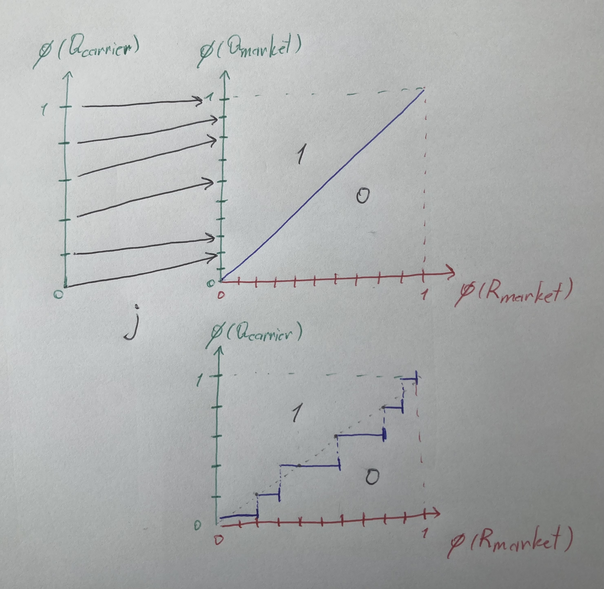
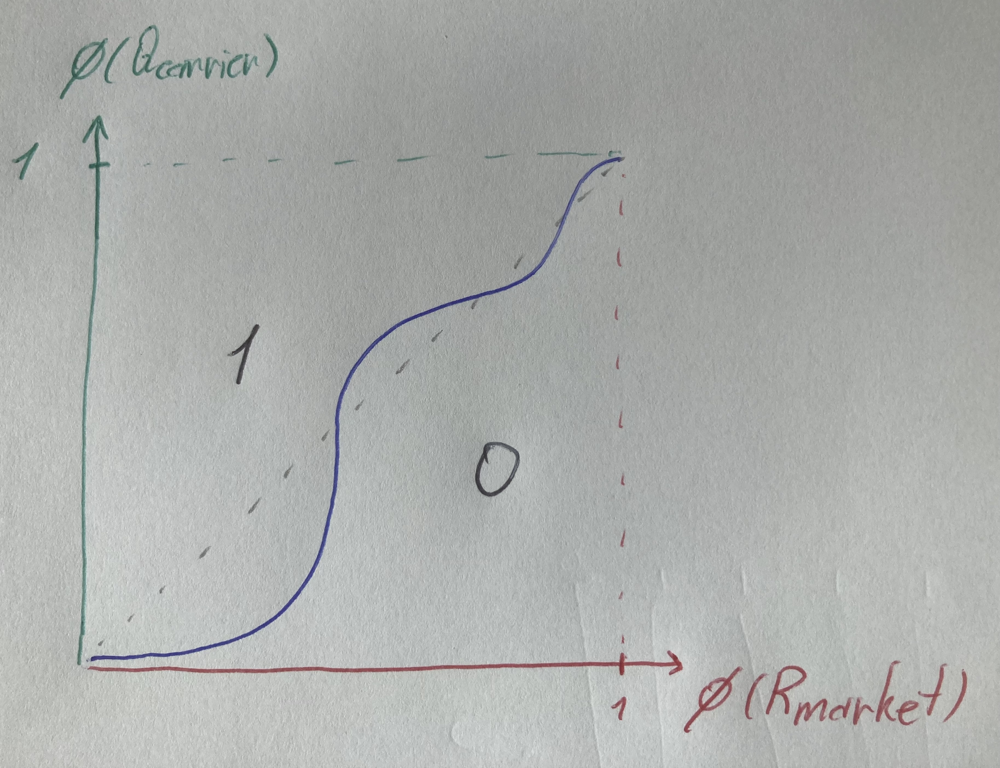

# An Order-Theoretic View of Quote Rejection in Container Shipping

Container-shipping rate setting often looks reactive and chaotic: market swings, inconsistent customer behavior, and noisy acceptance/rejection outcomes. But once we assume quote requests can be **totally ordered** and that feasible rates respect the same order, everything suddenly becomes simple and structured.

Once we embed both requests and rates into quantiles, the entire accept/reject logic becomes a simple comparison of numbers in $[0,1]$. From that starting point, willingness-to-pay, rejection (and booking) curves, and suggested selling rates all emerge naturally.

This post explains that structure step by step, building toward one key object:

> **The carrier-specific rejection probability curve** (the complement of the booking curve),  
> which is foundational for computing the **Suggested Selling Rate (SSR)**.

---

## 1. Market Requests as a Total Order

We begin with the set of all market quote requests:

$$
Q_{\text{market}} = \{q_{(1)}, q_{(2)}, \dots, q_{(N)}\}.
$$

We assume that **these requests can be totally ordered**:

$$
q_{(1)} \le q_{(2)} \le \dots \le q_{(N)}.
$$

### What does this order represent?

Many things in pricing behave monotonically:

- shipment volume  
- service urgency/flexibility  
- customer segment  
- historical behavior  
- any internal “flexibility” or “value” score

As long as *higher* in the order means *more willing to pay*, the model works.

---

## 2. Market Rates Respect the Same Ordering

We similarly assume the market has an ordered set of rates:

$$
R_{\text{market}}.
$$

There is a one-to-one **monotone map**:

$$
m : Q_{\text{market}} \to R_{\text{market}}
$$

assigning each request the “market-clearing” rate.

### Meaning of monotonicity

If one request is less sensitive and sits higher in the order, the rate assigned to it must not be lower than that of a more sensitive request.

---

## 3. Acceptance/Rejection as a Boolean Feasibility Relation
Because requests and rates share the same ordering, any quote request can be paired with any candidate market rate and classified: either the offered rate sits below that request’s clearing level and is accepted, or it exceeds it and is rejected.
Acceptance occurs when the offered rate does not exceed the clearing rate of the request. 
$$
r \le m(q).
$$

Formally, treat this as a feasibility relation: it is antitone in the rate (higher rates are harder to accept) and monotone in the request (less-sensitive customers accept more). Using the opposite order on rates makes the relation monotone in both arguments:

$$
F : R_{\text{market}}^{op} \times Q_{\text{market}}
\to \mathbf{Bool},
\qquad
F(r,q) = (r\le m(q)).
$$

This is the fundamental decision rule; rejection happens exactly when $F(r,q)$ is false. 

---

## 4. Quantile Embeddings: Putting Everything on $[0,1]$

To compare requests and rates cleanly, embed any finite total order $P$ into $[0,1]$ by turning each element into its cumulative rank: count how many elements are at or below it, then divide by $|P|$.

A more explicit form of that embedding:
- Begin with the canonical feasibility relation $\mathrm{hom}_P : P^{op}\times P \to \mathbf{Bool}$, which just records the order: $\mathrm{hom}_P(p',p) = \mathbf{true}$ exactly when $p'\le p$.

- Curry it in the first argument: fix $p$ and read $\mathrm{hom}_P(\,\cdot\,,p)$ as an ordinary function $P \to \mathbf{Bool}$—this is the indicator (1 if an element is in a set, 0 otherwise) of the principal down-set $\downarrow p$ (all elements $\le p$), written $\chi_{\downarrow p}(p') = \mathrm{hom}_P(p',p)$.

- Average those indicators uniformly over all $p' \in P$: sum the Boolean values (1 when $p' \le p$, 0 otherwise) and divide by $|P|$. This produces the quantile embedding below and is the same averaging used later when integrating feasibility relations in section 9.2:
$$
\phi_P(p)
= \frac{1}{|P|}
\sum_{p' \in P} \chi_{\downarrow p}(p')
= \frac{1}{|P|}
\sum_{p' \in P} \mathrm{hom}_P(p',p).
$$
Here the average simply measures the fraction of the set that lies in $\downarrow p$: each indicator contributes 1 when $p'$ is below $p$ and 0 otherwise, so the mean over all $p'$ gives the cumulative rank of $p$.

$$
\phi_P(p)
= \frac{|\{p' \in P : p' \le p\}|}{|P|}.
$$
### Request quantiles
Applied to market requests (take $P = Q_{\text{market}}$):

$$
\phi_Q(q) = \frac{|\{q' \in Q_{\text{market}} : q' \le q\}|}{|Q_{\text{market}}|}
= \frac{k}{N} \text{ for } q = q_{(k)}.
$$

Every request gets a rank between 0 and 1.

### Rate quantiles

$$
\phi_R : R_{\text{market}} \to [0,1].
$$

For rates, the same construction with $P = R_{\text{market}}$ gives:

$$
\phi_R(r) = \frac{|\{r' \in R_{\text{market}} : r' \le r\}|}{|R_{\text{market}}|}.
$$

Because $m$ is monotone and preserves ranks, $\phi_R \circ m$ and $\phi_Q$ coincide, so $Q_{\text{market}}$ and $R_{\text{market}}$ are isomorphic as total orders via the shared quantile axis.

$$
\phi_R(m(q_{(k)})) = \phi_Q(q_{(k)}).
$$

### Intuition

- Now every request and every rate corresponds to a *single number* in $[0,1]$.  
- They live on the same axis.  
- Higher quantile = higher willingness to pay / higher offered rate.

From here on we work entirely in quantile coordinates on $[0,1]$, reusing $r$ and $q$ to denote rate and request quantiles. To recover physical values, apply the inverses $\phi_R^{-1}$ or $\phi_Q^{-1}$ when needed.

---

## 6. Closures, Structural WTP, and the Rejection Adjunction

### Closures, the nucleus, and structural WTP

In quantile space, the market feasibility relation becomes a $\mathbf{Bool}$-enriched **profunctor** between the ordered quantile spaces of rates and requests:
$$
F : [0,1]^{op} \times [0,1] \to \mathbf{Bool},
\qquad
F(r,q) = \mathbf{true} \;\Longleftrightarrow\; r \le q.
$$
This single feasibility relation induces an adjunction between the powerset lattices $\mathcal{P}([0,1])$ of rates and requests via two dual closure operators:
- The **upper closure** gathers all rates that a family of requests would accept.
- The **lower closure** gathers all requests that would accept a family of rates.

Each is a monotone endomap on $\mathcal{P}([0,1])$; they are the two sides of a Galois connection from which both willingness-to-pay (WTP) and expected rejection levels will be derived as adjoint scalar maps.

### Upper closure

$$
F^\sharp : \mathcal{P}([0,1]) \to \mathcal{P}([0,1]), \qquad
F^\sharp(B)=\{ r \in [0,1] : \forall q\in B,\, F(r,q)\}.
$$
For a singleton $B=\{q\}$ this reduces to $F^\sharp(\{q\})=\{ r \in [0,1] : r \le q \}$; when no confusion arises, we abbreviate this as $F^\sharp(q)$.

In total orders, each downward-closed set has a maximum and each upward-closed set has a minimum. This lets us collapse the set-valued closure into an **extremal map**:
$$
r^* : [0,1] \to [0,1], \quad r^*(q)\;:=\;\max F^\sharp(q)
$$
where $r^*(q)$ stands for the largest rate still acceptable for request quantile $q$, or structural Willingless-To-Pay (WTP).

Visualising the $(\phi_R, \phi_Q)$ unit square:

- In the figure, the diagonal $x=y$ splits the unit square: points below it (blue-to-red side) are rejections ($q<r$), points above it are acceptances.
- Each quotation request corresponds to a horizontal line at its quantile $q$.
- The WTP $r^*(q)$ is the intersection with the diagonal $x=y$; projecting down gives the maximum feasible rate quantile.
- Feasible rates $F^\sharp(q)$  sit on or below that line (to the left of the intersection).
- Moving the horizontal line upward (higher $q$) shifts the WTP rightward (higher rate quantile).

### Lower closure

$$
F_\flat : \mathcal{P}([0,1]) \to \mathcal{P}([0,1]), \qquad
F_\flat(A)=\{ q \in [0,1] : \forall r\in A,\, F(r,q)\}.
$$
For a singleton $A=\{r\}$ this gives $F_\flat(\{r\})=\{ q \in [0,1] : r \le q \}$, which we abbreviate as $F_\flat(r)$. We then define:
$$
q^* : [0,1] \to [0,1], \quad q^*(r)\;:=\;\min F_\flat(r),
$$
where $q^*(r)$ is the least quotation request quantile that will still accept rate quantile $r$. This corresponds to structural rejection probability.

- Dually from Upper closure, for a fixed rate quantile $r$, the booking threshold $q^*(r)$ is the intersection of the vertical line at $r$ with the diagonal; projecting left gives the least request quantile that will accept that rate.
- If a rate sits at quantile 0.3, then 30% of requests sit below it → they reject.  
- The market rejection curve is a straight line with slope 1 (the booking curve is its complement, $1-r$).  

### The nucleus
<!-- TODO Please edit the inline symbols -->
The **nucleus** of feasibility relation $F$ is defined as subsets from phi_R^{op} x phi_Q such as
<!-- TODO Please add which sets A and B belong to -->
$$
\mathrm{Nuc}(F)=\{(A,B): A=F^\sharp(B),\, B=F_\flat(A)\}.
$$

Elements of the nucleus are pairs of closed sets that are "as tight as possible" with respect to the feasibility relation: $A$ is exactly the set of rates supported by $B$, and $B$ is exactly the set of requests supporting $A$. In our total-order setting every nucleus element has the form
$$
(A,B)=([0,r],[q,1])
$$
i.e. a downward-closed interval together with its matching upward-closed interval.

Equivalently we can represent nucleus pairs in terms of their extremal points
$$
\mathrm{Nuc}(F)=\{(r,q): r=r^*(q),\, q=q^*(r)\}.
$$

<!-- TODO Please edit and tidy up the below, also we need to com up with subsection name for the following paragraphs, something to do with mutually adjoint subsets -->
So we get a bijective correspondance between subsets of R and Q, induced by maps r^* and q^*. Just to recap:

map WTP:=r^* answers the question: "For a given quotation request quantile what proportion of all market rate will it accept? In other workds what is the largest acceptable rate quantile?"

The rejection probability map q^* answers the dual question: "At this posted rate, what share of the market walks away? Or equivalently what is the lowest quotation request that will accept"

---

## 7. A Carrier’s Customer Subset

Let:

$$
j : Q_{\text{carrier}} \hookrightarrow Q_{\text{market}}
$$

be inclusion.

Carrier-induced rate map:

$$
m\circ j : Q_{\text{carrier}} \to R_{\text{market}}.
$$

Carrier quantile embedding:

$$
\phi_{\text{carrier}}(q)
=
\frac{
|\{q' \in Q_{\text{carrier}} : q' \le q\}|
}{
|Q_{\text{carrier}}|
}.
$$

This expresses the carrier’s internal demand distribution on the same $[0,1]$ quantile axis.

- The inclusion $j$ pulls carrier requests into market order; composing with $m$ places them on the shared quantile line.
- The carrier distribution typically sits at different quantiles than the market, reflecting its mix.
- With $\phi_{\text{carrier}}$ we compare carrier demand and market rates on the same $[0,1]$ axis.

- Pulling back the market feasibility along $j$ and $m$ smooths the sharp diagonal into the carrier’s own contour.
- The boundary shifts off $x=y$ because the carrier sees a different mix; acceptance at a given rate quantile can be above or below market.
- The band still monotone-separates accept/reject regions, defining the carrier’s feasibility frontier.
---

## 8. Why We First Need the Carrier Rejection Curve to Define SSR

The carrier-specific rejection curve is:

$$
\rho_{\text{carrier}}(r)
=
\Pr(\text{rejection at rate } r \mid q\in Q_{\text{carrier}})
= 1 - \Pr(\text{booking at rate } r \mid q\in Q_{\text{carrier}}).
$$

Each carrier sees a **non-uniform slice** of the market →  
each has its **own** rejection curve (and thus its own booking curve by complement).

### SSR is chosen *from* this curve

Examples:

- volume-oriented carriers → target small $\rho_{\text{carrier}}(r)$ (high acceptance),  
- yield-oriented carriers → maximize $r \cdot (1-\rho_{\text{carrier}}(r))$,  
- balanced strategies → choose quantile-based rejection levels.

Thus:

> **To define SSR, we must first derive $\rho_{\text{carrier}}(r)$.**

---

## 9. Structural Derivation of the Carrier Rejection Curve

Two structural paths:

- **Approach A:** via willingness-to-pay  
- **Approach B:** via pullback → curry → average  

Both produce the same $\rho_{\text{carrier}}(r)$.

---

## 9.1 Approach A — Via Carrier Willingness-to-Pay

The market WTP function in quantile space is simply:

$$
r^*(q)=q.
$$

Restrict to the carrier:

$$
r^*_{\text{carrier}}(q) = r^*(j(q)) = \text{market quantile of } j(q).
$$

This yields each carrier customer's **maximum feasible rate**; to recover the physical rate, apply $\phi_R^{-1}(r^*_{\text{carrier}}(q))$.

### Constructing the carrier rejection curve

$$
\rho_{\text{carrier}}(r)
=
\frac{
|\{ q \in Q_{\text{carrier}} : r > r^*_{\text{carrier}}(q) \}|
}{
|Q_{\text{carrier}}|
}.
$$

### Quantile expression

$$
\rho_{\text{carrier}}(r)=\phi_{\text{carrier}}(q_r),
$$
where $q_r$ is the market request at quantile $r$ (equivalently, the point on the diagonal with request quantile $q=r$).

---

## 9.2 Approach B — Pullback → Curry → Average

### Step 1 — Pullback

$$
F_{\text{carrier}}(r,q)=F(r,j(q)).
$$

### Step 2 — Curry

$$
\chi_r(q)=F_{\text{carrier}}(r,q).
$$

### Step 3 — Average

$$
\rho_{\text{carrier}}(r)
=
\frac{1}{|Q_{\text{carrier}}|}
\sum_{q\in Q_{\text{carrier}}} (1-\chi_r(q)).
$$

### Why this matters

- Works directly with the feasibility relation (booking = $\chi_r$, rejection = $1-\chi_r$)  
- Natural for estimation  
- Equivalent to WTP approach in total orders

---

## 10. Estimation Regimes

Observed data:

$$
(r_i, q_i, y_i),\qquad y_i\in\{0,1\}.
$$

Here $y_i=1$ means a booking (so $1-y_i$ is a rejection indicator). Two behavioral assumptions:

### Targeted (WTP-aligned) pricing

$r_i \approx r^*(q_i)$.

### Random-rate pricing

$$
y_i\sim \mathrm{Bernoulli}(q_i \ge r_i).
$$

Each produces a different estimator $\widehat{\rho}_{\text{carrier}}(r)=1-\widehat{\beta}_{\text{carrier}}(r)$.

---

## 11. Closing Thoughts

Under the total-order assumption:

- accept/reject = comparing quantiles  
- WTP = maximum feasible rate  
- carrier demand = market subset  
- carrier rejection curve = head probability (booking is its complement)  
- **SSR = a chosen point balancing rate and rejection**

This framework generalizes to multidimensional request spaces and non-total orders.

---
