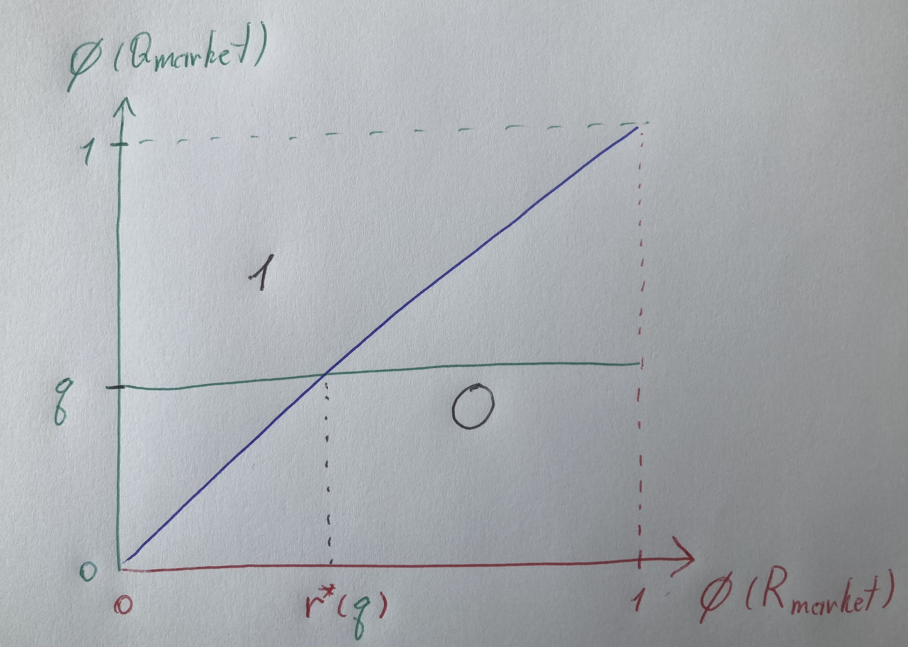
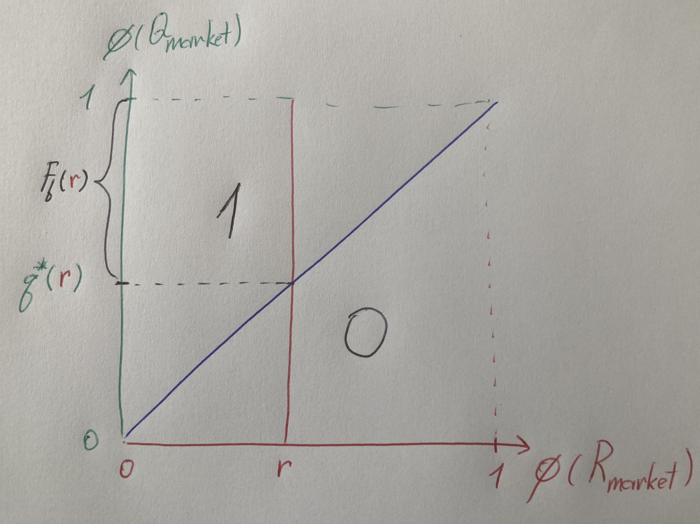
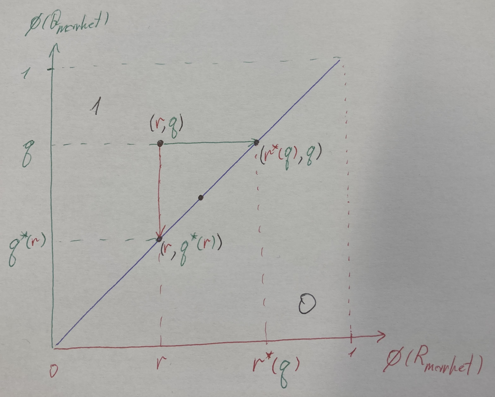

## 5. Closures, Structural WTP, and the Rejection Adjunction

### Closures, the nucleus, and structural WTP

In quantile space, the market feasibility relation becomes a $\mathbf{Bool}$-enriched **profunctor** between the ordered quantile spaces of rates and requests:

$$
F : [0,1]_R^{op} \times [0,1]_Q \to \mathbf{Bool},
\qquad
F(r,q) = \mathbf{true} \; \Longleftrightarrow \; r \le q.
$$

This single feasibility relation induces an adjunction between the powerset lattices $\mathcal{P}([0,1])$ of rates and requests via two dual closure operators:
- The **upper closure** gathers all rates that a family of requests would accept.
- The **lower closure** gathers all requests that would accept a family of rates.

Each is a monotone endomap on $\mathcal{P}([0,1])$; they are the two sides of a Galois connection from which both willingness-to-pay (WTP) and expected rejection levels will be derived as adjoint scalar maps.

### Upper closure

$$
F^\sharp : \mathcal{P}([0,1]) \to \mathcal{P}([0,1]), \qquad
F^\sharp(B)=\{ r \in [0,1] : \forall q\in B,\, F(r,q)\}.
$$

For a singleton $B=\{q\}$ this reduces to $F^\sharp(\{q\})=\{ r \in [0,1] : r \le q \}$; when no confusion arises, we abbreviate this as $F^\sharp(q)$.

In total orders, each downward-closed set has a maximum and each upward-closed set has a minimum. This lets us collapse the set-valued closure into an **extremal map**:

$$
r^* : [0,1] \to [0,1], \quad r^*(q)\;:=\;\max F^\sharp(q)
$$

where $r^*(q)$ stands for the largest rate still acceptable for request quantile $q$, or structural Willingless-To-Pay (WTP).

Visualising the $(\phi_R, \phi_Q)$ unit square:

- In the figure, the diagonal $x=y$ splits the unit square: points below it (blue-to-red side) are rejections ($q<r$), points above it are acceptances.
- Each quotation request corresponds to a horizontal line at its quantile $q$.
- The WTP $r^*(q)$ is the intersection with the diagonal $x=y$; projecting down gives the maximum feasible rate quantile.
- Feasible rates $F^\sharp(q)$  sit on or below that line (to the left of the intersection).
- Moving the horizontal line upward (higher $q$) shifts the WTP rightward (higher rate quantile).

### Lower closure

$$
F_\flat : \mathcal{P}([0,1]) \to \mathcal{P}([0,1]), \qquad
F_\flat(A)=\{ q \in [0,1] : \forall r\in A,\, F(r,q)\}.
$$

For a singleton $A=\{r\}$ this gives $F_\flat(\{r\})=\{ q \in [0,1] : r \le q \}$, which we abbreviate as $F_\flat(r)$. We then define:

$$
q^* : [0,1] \to [0,1], \quad q^*(r)\;:=\;\min F_\flat(r),
$$

where $q^*(r)$ is the least quotation request quantile that will still accept rate quantile $r$. This corresponds to structural rejection probability.

- Dually from Upper closure, for a fixed rate quantile $r$, the booking threshold $q^*(r)$ is the intersection of the vertical line at $r$ with the diagonal; projecting left gives the least request quantile that will accept that rate.
- If a rate sits at quantile 0.3, then 30% of requests sit below it → they reject.  
- The market rejection curve is a straight line with slope 1 (the booking curve is its complement, $1-r$).  

### The nucleus

Working in quantile coordinates, we view the feasibility relation as a $\mathbf{Bool}$‑enriched profunctor

$$
F : [0,1]_R^{op} \times [0,1]_Q \to \mathbf{Bool},
$$

where we implicitly identify market rates and requests with their quantiles via $\phi_R$ and $\phi_Q$. The **nucleus** of $F$ is the subset

$$
\mathrm{Nuc}(F) \;\subseteq\; \mathcal{P}([0,1]_R) \times \mathcal{P}([0,1]_Q)
$$

of pairs $(A,B)$ of rate‑ and request‑quantile sets defined by

$$
\mathrm{Nuc}(F) = \{(A,B) : A = F^\sharp(B),\; B = F_\flat(A)\},
$$

with $A \subseteq [0,1]_R$ a set of rate quantiles and $B \subseteq [0,1]_Q$ a set of request quantiles. Such pairs are “as tight as possible” with respect to $F$: $A$ is exactly the set of rates supported by $B$, and $B$ is exactly the set of requests supporting $A$.

The extremal maps introduced above

$$
r^* : [0,1]_Q \to [0,1]_R, \quad r^{*}(q) := \max F^\sharp(\{q\}),
$$

$$
q^* : [0,1]_R \to [0,1]_Q, \quad q^{*}(r) := \min F_\flat(\{r\}),
$$

extract these interval endpoints. Every nucleus pair can be encoded either by its request endpoint or by its rate endpoint:

$$
\mathrm{Nuc}(F)
= \{([0,r^*(q)],[q,1]) : q \in [0,1]_Q\}
= \{([0,r],[q^*(r),1]) : r \in [0,1]_R\}.
$$

Equivalently, we may parameterize nucleus pairs just by their extremal points:

$$
\mathrm{Nuc}(F)_{\mathrm{ext}}=\{(r,q) \in [0,1]_R \times [0,1]_Q : r = r^*(q),\; q = q^*(r)\}.
$$

- A generic off-diagonal point $(r,q)$ is mapped horizontally to $(r^*(q),q)$ and vertically to $(r,q^*(r))$, illustrating how WTP and rejection are extracted as extremal summaries of the feasibility relation.
- Points on the diagonal where $r=r^*(q)$ and $q=q^*(r)$ are fixed by these mappings; these diagonal points are exactly the elements of $\mathrm{Nuc}(F)_{\mathrm{ext}}$.
- The figure thus shows how the nucleus picks out a one‑dimensional set of extremal points while arbitrary $(r,q)$ pairs are mapped onto this WTP/rejection correspondence.

<!-- TODO make the below a separate section -->
### Adjoint scalar maps, WTP, and rejection

The scalar maps $r^*$ and $q^*$ summarize the nucleus at the level of individual quantiles.

- The **WTP map** $r^* : [0,1]_Q \to [0,1]_R$ answers:
  > For a given quotation request quantile $q$, what is the largest rate quantile that this request will still accept?
  
  Order‑theoretically, the feasible rate set $F^\sharp(q)$ is an initial segment of the rate‑quantile line, and $r^*(q)$ is simply its right endpoint: the supremum rate that remains acceptable for requests at level $q$.

- The **rejection map** $q^* : [0,1]_R \to [0,1]_Q$ answers the dual question:
  > For a given rate quantile $r$, what is the lowest quotation‑request quantile that will accept this rate?
  
  Dually, the feasible request set $F_\flat(r)$ is a terminal segment of the request‑quantile line, and $q^*(r)$ is its left endpoint: the infimum request quantile that still accepts the rate level $r$.

Given a uniform distribution of request quantiles on $[0,1]_Q$, this same map $q^*$ explains why we call it “rejection”: the fraction of requests that reject at rate $r$ is exactly the mass of quantiles below $q^*(r)$, which by uniformity equals $q^*(r)$ itself. In the fully symmetric normalization used here we have $q^*(r)=r$, so the rejection probability at rate quantile $r$ is $r$ and the booking probability is $1-r$.

The pointwise nucleus $\mathrm{Nuc}(F)_{\mathrm{ext}}$ packages the dual correspondence between these two scalar summaries: each pair $(r,q)$ with $r=r^*(q)$ and $q=q^*(r)$ links a structural WTP level $r$ to the rejection quantile $q$ it induces. Composing the WTP map with the rejection map makes this correspondence explicit:

$$
q^*(r^*(q)) = q.
$$

In words: at the structural willingness‑to‑pay level of a request at quantile $q$, the market rejection probability is precisely $q$ itself (and the corresponding booking probability is $1-q$). WTP levels and rejection probabilities are thus two views of the same nucleus‑induced correspondence.

---
